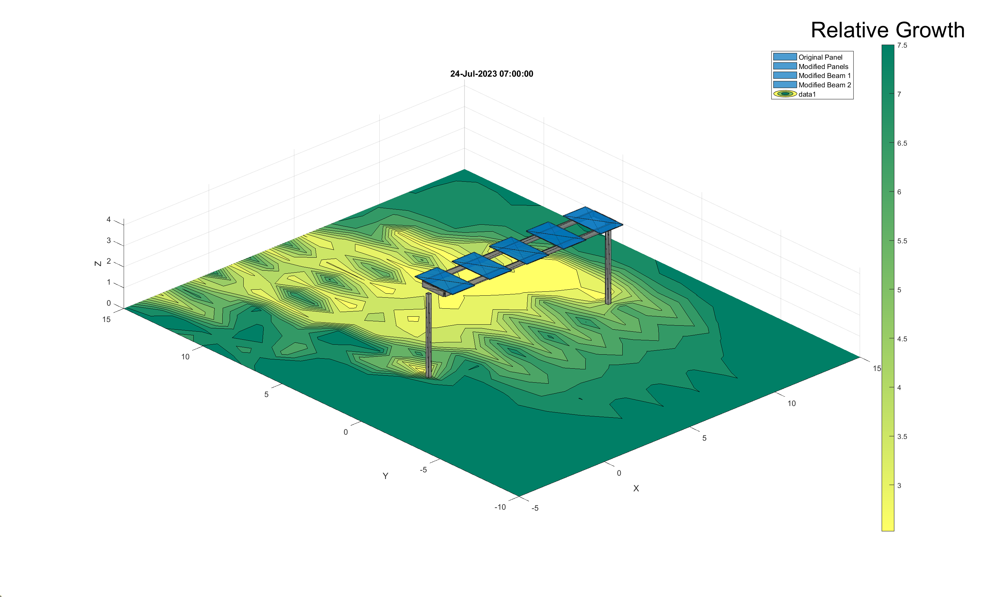

# Simulation and Design Optimisation Model for Agrivoltaics 🌱☀️

This project develops a **digital twin of an agrivoltaic scenario**, simulating both **solar energy generation** and **agricultural crop yields** under shared land use. The model serves as a **simulation and design optimisation tool**, enabling exploration of design parameters to improve both photovoltaic (PV) and crop performance.  

The overarching goal is to demonstrate how agrivoltaic systems can be optimised to maximise land productivity, providing a balance between **renewable energy production** and **sustainable agriculture**.  

For a more detailed explanation of the modelling methodology, you can download the full report here: [Frank_Panton_Individual_Annex.pdf](figures/Frank_Panton_Individual_Annex.pdf).  

---

## 🔧 Model Setup

The model recreates our modular agrivoltaic design in MATLAB, defining a range of design parameters such as:

- **Module geometry**: panel size, tilt, and tracking configuration  
- **Array structure**: row spacing, ground coverage ratio (GCR), height  
- **Environmental inputs**: solar irradiance, weather data, soil properties  
- **Crop parameters**: light use efficiency, phenology, water balance  

The system is built as a **modular framework**, allowing independent validation and analysis of its core components:  

- **Solar energy modelling**  
- **Shading and irradiance reduction**  
- **Microclimate modelling**  
- **Crop growth modelling**

### Visualisation of the Setup

  

*Figure: MATLAB recreation of the agrivoltaic modules in rows. 

---

## ☀️ Solar Modelling

The solar model incorporates **tracking algorithms** and computes **direct and diffuse irradiance** incident on both the panels and the ground beneath the structure.  

- **Shading Factor**: quantifies the reduction in irradiance at the ground caused by the array.  
- **Sensitivity Analysis**: demonstrates the relationship between GCR and shading, validating against reported values in literature.  

  

*Figure: Example shading simulation visualised as irradiance distribution beneath the array.*  

---

## 🌡️ Microclimate Modelling

The microclimate model captures the effects of shading on **temperature, humidity, and soil water balance** beneath the array.  

- **Evapotranspiration**: calculated dynamically to determine plant water use.  
- **Water Stress**: integrated into the crop growth model via rainfed vs irrigated scenarios.  

This allows analysis of how **reduced solar input** interacts with **water availability**, directly influencing crop performance.

---

## 🌾 Crop Growth Modelling

The crop growth was modelled using the SIMPLE model, a widely applied framework for simulating water and nitrogen balance and crop production (see [SIMPLE model reference](https://www.sciencedirect.com/science/article/abs/pii/S1161030118304234)).  

- **Inputs**: 13 crop-defining parameters, microclimate modelling outputs, solar energy reduced by the shading of the agrivoltaic array.
- **Outputs**: yield reduction under shade, validated against reported crop trials.  
- **Scenarios**: open-field baseline, agrivoltaic with shading, and irrigated vs rainfed systems.  

  

*Figure: Distribution of crop yield due to the shading distribution caused by one module.

---

## 📈 Optimisation Perspective

By coupling **solar yield** and **crop growth** in one framework, the tool can be used to:  

- Explore the trade-off between energy and food production.  
- Optimise design parameters such as **row spacing, height, and tracking**.  
- Support **site-specific agrivoltaic deployment strategies**.  

---

